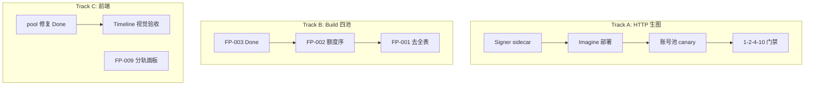

# 多线执行计划（2026-07-22）

> 覆盖：HTTP 生图 10/10 验收、Signer 产品化、Imagine 额度+modelStates 部署、Build 四池后续待办、账号页 invalidResponse 修复。

---

## 阶段 0 — 工作区收口（当前）

| 项 | 状态 | 说明 |
| --- | --- | --- |
| 账号列表 `pool` 空串导致 invalidResponse | **Done** | `pool` 仅 Build 返回；`omitempty` + 前端 optional |
| Imagine 额度 + modelStates 代码 | **已提交** | `73e4ab2` |
| FP-001 / FP-002 / Signer sidecar | **已提交** | `ca31ec8` |
| FP-003 lane 计数 | **Done** | `statistics.laneAttempts`（含于 `73e4ab2`） |
| `go test ./...` + signer 单测 | **通过** | 已 push，待 CI/GHCR |

**下一步**：CI 通过后 Panda 部署 signer + 新 digest → 单账号 Imagine 闭环 → 逐号 canary。

## 阶段 1 — Signer 产品化（阻塞项，先于 Imagine 部署）

当前 Panda 依赖 `/tmp/start_signer_nsenter.sh` + 宿主机 Python；`compose up` 后必须手工重拉 signer。

### 交付物

1. `grok-signer` 镜像（`POST /sign`、`GET /healthz`、`GET /readyz`）— **MVP Done**，见 [signer-sidecar.md](./signer-sidecar.md)
2. `deploy/panda/docker-compose.yml` 增加 `grok-signer` sidecar — **Done**
3. `config.yaml`：`statsigSignerURL: http://grok-signer:8788/sign`
4. L1 健康：pair 存在 + `/sign` 产出 70B base64
5. L2 就绪：经 udeal egress 对 `POST /rest/rate-limits` 验签被上游接受
6. 启动时模块发现（`tools/_discover_signer_module.py` 逻辑）

### 验收

- `docker compose up` 后无需手工 nsenter
- signer `/readyz` 200 且 grok2api `depends_on: service_healthy`
- 单账号 Lite 200（纯 HTTP，无 bridge）

---

## 阶段 2 — Imagine 额度 + modelStates 生产部署

捆绑在同一主镜像 digest，**在 Signer ready 之后**。

### 步骤

1. Panda preflight：容量检查 + DB 备份
2. `docker compose pull && up`（signer + grok2api 新 digest）
3. 自动迁移 `account_model_states`
4. 单账号闭环：刷新 Imagine 额度 → API/UI 检查 → 1 次 Lite → 验证 `modelStates` 流转
5. 验证 `0/0` 不误判耗尽；Imagine 失败不影响聊天路由

### 回滚点

- 备份 DB 路径记录于部署日志
- 旧镜像 digest 保留在 `.env.bak`

---

## 阶段 3 — 账号池建设 + 并发 canary

### 3.1 逐号 Lite canary

- 对 20 个 `grok_web` dispatch 账号：单并发、低速
- 记录：quota total/remaining、modelState、HTTP 状态、soft-stop、耗时
- 目标：**≥10 个** 近期 `available` 且不在冷却

### 3.2 分档门禁 `1→2→4→10`

| 档位 | 通过条件 |
| --- | --- |
| 1 | 1/1 有效图片 |
| 2 | 2/2，P50/P90 记录，无同账号并发冲突 |
| 4 | 4/4，无本地 pipeline 429 |
| 10 | 10/10，成功率 ≥95%，P90 ≤45s |

工具：`tools/panda_image_conc_canary.py`，`GROK2API_GROUPS=2,4,10`

### 3.3 生产安全 canary 清单

- [ ] DB 备份
- [ ] 单账号验证闭环
- [ ] Timeline API 84+ traces
- [ ] 浏览器 `/image-timeline` 甘特验收（D9）
- [ ] 记录 manifest digest + canary JSON

---

## 阶段 4 — Build 四池 P1 待办

| 顺序 | ID | 状态 | 说明 |
| --- | --- | --- | --- |
| 1 | FP-004 | **Done** | 代码已无 ListRecovery/ListPurge API |
| 2 | FP-003 | **Done** | laneAttempts 已暴露 |
| 3 | FP-002 | Todo | DispatchIndex 写入真实 billing 额度 |
| 4 | FP-001 | Todo | Acquire 去全表 + normal 池 probe ID 并集 |
| 5 | FP-005 | Todo | 同步过时 backlog 文案 |

P2（FP-007～012）在阶段 3 验收通过后插入。

---

## 阶段 5 — P1/P2 增强（下一迭代）

- `webConcurrency` 6–8 评估（G7）
- soft_stop AIMD 生产调参（G10）
- 双探针分轨面板（FP-009）
- Analytics 四池化（FP-012）
- Signer 自动模块发现 cron + pair 轮换 playbook

---

## 并行分工建议

---

## 关联文档

| 文档 | 用途 |
| --- | --- |
| [08-image-pipeline-status-2026-07-22.md](./08-image-pipeline-status-2026-07-22.md) | 生图流水线部署状态 |
| [09-imagine-quota-model-state-and-10-concurrency-todos-2026-07-22.md](./09-imagine-quota-model-state-and-10-concurrency-todos-2026-07-22.md) | Imagine 接续清单 |
| [08-build-four-pool-dual-probe-todos-2026-07-22.md](./08-build-four-pool-dual-probe-todos-2026-07-22.md) | 四池 FP-* 全量 |
| [signer-sidecar.md](./signer-sidecar.md) | Signer sidecar 部署与 env |
