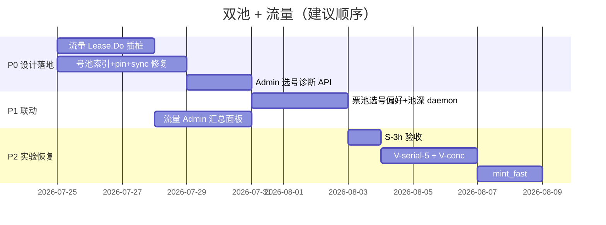

# grokImage 后续实施计划（2026-07-24）

> **门禁**：在 **号池调度 + 票池供给** 双池设计落地并通过验收前，**暂停** Chrome 票生命周期实验、V-conc、mint_fast 等生图压测。  
> 出口/带宽/账号 503 反复卡死根因是「三套池不一致 + 选号不感知票」，不是票本身失效。

## 语言与实现分层（硬约束）

> **Python 只作原型（PoC）**：验证协议、流程、指标与验收标准。  
> **跑通验收后，生产级实现用 Rust**（本机/边缘 CLI、灌池、探针、压测、运维工具）。  
> **Panda 网关核心**（调度、票池存储、egress 插桩、Admin API）仍在 **Go** `backend/`，不迁 Rust。

| 层级 | 原型（Python） | 生产实现 | 说明 |
|------|----------------|----------|------|
| **grok2api 服务端** | — | **Go** | 号池索引、Selector、chrometicket 池、egress `Lease.Do` 流量 |
| **本机/运维 CLI** | `tools/*.py`、`_panda_*.py` | **Rust** `tools/*_rs/` | 探针、pin、灌池 daemon、实验 runner、带宽压测 |
| **HTTP 生图/签名 canary** | `web_http_chat_image_canary.v1.py` | `web_http_chat_image_canary_rs`（已有） | Rust 可 subprocess 调 Python **仅** Playwright 短签，HTTP 全 Rust |
| **Chrome 开票** | `chrome_ticket_pool_minter.py` | **Rust** `tools/grok-ticket-minter-rs`（待建） | 浏览器步骤可暂保留 `sign_helper.py` 子进程，协议与 Admin push 迁 Rust |
| **实验编排** | `chrome_ticket_*_runner.py` | **Rust** `tools/grok-experiment-rs`（待建） | jsonl 契约不变，执行器换 Rust |

**迁移门禁**：Python PoC 须先冻结 **JSON 契约**（输入/输出/退出码）；Rust 对齐同一契约且验收用例全过后，Python 标 `deprecated`。

**禁止**：未跑通 Python PoC 前写 Rust；PoC 通过后长期以 Python 作生产依赖（Playwright 薄壳除外）。

## 0. 背景与问题陈述

| 现象 | 根因（已调研） |
|------|----------------|
| 生图 503「无可用上游账号」 | `model_route_accounts` pin、`imagePoolIds`（展示）、`dispatchIndex`（调度）**三套池不一致**；pin 的号不在 dispatch 索引 |
| `prepare_imagine.py` 只 pin 单号 | 覆盖删除其他 pin；reconcile **不重建** dispatch 索引 |
| 票 `pool_hit` 仍 503 | 账号层失败；票池与选号**正交**，Selector 不查 `chrome_tickets` |
| 带宽「没统计」 | 仅有 07-21 单口压测 + `media_assets` 体积；**无逐请求 egress 字节计量** |
| 实验反复卡在账号 | 运维动作（pin/reconcile）与运行时索引漂移；非随机故障 |

子 agent 调研归档：
- 号池调度：[explore account pool](agent:account-pool) → 见本文 §2
- 票池：[explore chrome ticket](agent:chrome-ticket) → 见本文 §3
- 流量插桩：[explore egress traffic](agent:egress-traffic) → 见本文 §1

---

## 1. 代理流量全量统计（凡走代理必计）

### 1.1 目标

凡经 **egress 租约** 发出的 HTTP（生图、对话、额度、探针、Statsig warm、asset 下载、Build CLI）全部计量，并可细分：

| 维度 | 说明 |
|------|------|
| `egress_scope` | `grok_web` / `grok_web_asset` / `grok_web_expand` / `grok_build` / `grok_console` |
| `egress_node_id` | 节点 DB id；展示脱敏 `host:port` |
| `provider` | `grok_web` / `grok_build` / … |
| `operation` | audit 对齐：`image` / `chat` / `quota` / `maintenance_probe` / `statsig_warm` / `asset_download` / `expand` / … |
| `pipeline_stage` | Lite 流水线：`ps` / `sse` / `download` / `upload`（有则填） |
| `account_id` | 业务账号；探针类可为空 |
| `request_id` | 与 `request_audits` / `image_pipeline_traces` 关联 |
| `direction` | `request_bytes` / `response_bytes` |
| `transport` | `tls_client` / `build_http` / `browser_bridge`（bridge 分轨） |

### 1.2 插桩点（最小侵入）

```
Build:  cli/egress.go egressTransport.RoundTrip  ─┐
Web:    egress.Lease.Do 包装 countingLease        ─┼→ context Accumulator → 异步写库
Pipeline: scheduler.Admit 注入 request_id/stage ─┘
```

**不在** `Feedback()` 写流量；与健康度解耦。

### 1.3 存储

| 层 | 表/字段 | 用途 |
|----|---------|------|
| 明细 | `egress_traffic_hops` | 每 hop 一行；索引 `(request_id)`, `(egress_node_id, created_at)`, `(scope, created_at)` |
| 汇总 | `request_audits.egress_traffic_json` 或独立 rollup | Admin 单请求总览 |
| 日聚合 | `egress_traffic_daily`（P2） | 节点计费、供应商对账 |

### 1.4 非客户流量

维护探针 / quota sync / statsig warm：`operation=maintenance_*`，`request_id` 合成 `probe:{account_id}:{ts}`，与计费请求分开统计。

### 1.5 缺口与 P2

- **browser_bridge** 模式：Chromium 数据面不经 `Lease.Do` → bridge 回传 `stats` 或 CDP Network 计数（P2）
- **udeal 供应商账单**：无 API；以 `egress_node_id` 日聚合与供应商面板人工对账

### 1.6 验收

- [ ] 单次 Lite 生图 200：`grok_web`（SSE）+ `grok_web_asset`（下图）hop 各 ≥1，字节与 `media_assets.size_bytes` 同量级
- [ ] 维护探针 hop 计入 `maintenance_probe`，不污染客户 request rollup
- [ ] Admin 可按节点/scope/日查看 MB 汇总

**实现工单**：BE-018（P0）— **Go** 服务端插桩；Python `tools/egress_traffic_probe.py` 仅作读 Admin API 的 PoC，通过后 **Rust** `grok-traffic-cli-rs` 替代。

---

## 2. 号池（Web 双轨三池）完善

### 2.1 设计原则：单一调度真相源

```
dispatchIndex (运行时 BTree) = 唯一「谁能被 Selector 抽到」
imagePoolIds / chatPoolIds   = 从 dispatchIndex 导出的只读投影（可保留 cap=50 展示）
model_route_accounts         = 实验/运维「硬约束」；必须 ⊆ dispatchIndex 构建交集
```

### 2.2 索引构建（`indexWebAccountLocked` 增强）

构建 dispatch 条目时 **同时** 检查：

1. `enabled` + `auth=active`
2. 对应 lane 三池位置 = `dispatch`（非 recovery/dead）
3. `imagePoolEligible`（imagine 新鲜额度、model state、block）
4. **`model_route_accounts`**：若 route 有 binding → 仅 bound 账号
5. （可选）**票池感知**：`chrome_tickets.available > 0`（见 §3.2）

### 2.3 事件驱动 `syncWebAccountIndex`

以下操作后 **必须** 调用 `syncWebAccountIndex(id)` 或 `RebuildWebPoolIndex`：

| 触发 | 当前缺口 |
|------|---------|
| `ReconcileWebPools` disable | ❌ 未同步 |
| `model_route_accounts` 变更 | ❌ 未同步 |
| quota sync / model state 更新 | 部分（仅探针路径） |
| enable/disable 账号 | 部分 |

### 2.4 Pin 工具修正

| 问题 | 修复 |
|------|------|
| `_panda_pin_imagine.py` 每次 DELETE 全 route | 支持 **追加/替换列表**；`prepare_imagine.py` 传入**完整** pin 集，不单 pin 一个 |
| pin 后 503 | Admin API 返回 `pin_not_in_dispatch: [ids]` 与原因（recovery / imagine_stale / not_enabled） |
| reconcile 误 disable 图号 | 图轨 disable 逻辑看 **imagine** 窗口，与 chat fast 解耦（BE-019） |

### 2.5 503 可观测性

`SelectionUnavailableError` 对外保持现有 code；Admin/internal 增加：

- `selection_reason`: `no_dispatch_index` | `pin_filtered` | `quota_stale` | `saturated` | `cooling`
- 指标：`dispatch_image_len`, `pin_filtered_count`, `imagine_stale_count`, `saturated_waits`

### 2.6 并发与池容量

| 参数 | 当前 | 目标（双池就绪后） |
|------|------|-------------------|
| imagine dispatch 可用号 | ~50 投影，实验 pin 4 | **显式** `min(dispatch_image, pin∩dispatch)` ≥ SSE 并发 |
| `grok-imagine-image` 每账号 lease | 1 | 保持；避免 10 SSE 槽打 3 号全 `saturated` |
| `WebConcurrency` | 2 | 号池稳定后 2→4→8 |

**实现工单**：BE-019（P0）✅、BE-020（P1）✅ — **Go** 服务端；运维 pin/reconcile：**Python PoC** → **Rust** `grok-pool-ops-rs`。

### 2.7 Web Image 四池（BE-023，进行中）

> 三池 `recovery` 与 `dispatch` 准入不对称，软停/耗尽号可进调度。完整设计与成功率对照见 [17-web-four-pool-and-imaging-success-rates-2026-07-24.md](./17-web-four-pool-and-imaging-success-rates-2026-07-24.md)。

| 池 | 准入要点 |
|----|----------|
| dispatch | `candidateImagineQuotaAdmissible` + 健康 `modelState` |
| normal | soft_stop / quota_exhausted / 额度陈旧 |
| verification | 新号 / unknown |
| delete | reauth / signature_failed / deletable |


## 3. 票池（Chrome Ticket Pool）完善

### 3.1 职责边界（保持不变）

- 票池 **不选号**；仅在 `generateLiteImageURL` 对 **已选 account_id** `PopForAccount`
- 无票 → 静默回退无票路径（可能 403）；**生产应消灭无票回退**

### 3.2 与号池联动

> **2026-07-26 更新**：BE-021（选号偏好有票）已落地；下一阶段 **BE-024** 将票池 **逻辑并入** 号池调度视图（TicketReady / SlotRegistry），见 [20-ticket-ready-slot-dispatch-merge-2026-07-25.md](./20-ticket-ready-slot-dispatch-merge-2026-07-25.md)。

| 策略 | 说明 | 状态 |
|------|------|------|
| **A. 选号偏好有票** | `Acquire` 排序加权有票账号 | ✅ BE-021 |
| **B. TicketReady 硬视图** | 调度只认 `dispatch ∩ pin ∩ 有票`；固定 SlotRegistry | 📋 BE-024 |
| **C. 池深目标** | `target_per_account` + JIT daemon | 部分（`jit_mint_concurrent` PoC） |

### 3.3 运维单一化

| 项 | 动作 |
|----|------|
| Admin 密码 | BE-017：单一真相源 |
| 灌池 | 本机 `chrome_ticket_mint_daemon.py`（PoC）→ **Rust** minter；目标深度跟 `SSESlots` 联动 |
| 废弃 | 明确 deprecated `panda_ticket_pool.py` |

### 3.4 票生命周期（实验暂停，设计保留）

- Pop 即 consumed；同 meta 可 re-push（已验证）
- 失败回收（consumed→available）：P2，非阻塞双池

**实现工单**：BE-021（P1 选号感知）、BE-015/016 实验 **冻结至门禁解除**

---

## 4. 实施阶段与门禁



### 门禁检查表（全部 ✅ 后才恢复生图压测）

- [x] pin N 个号 → Admin 显示 N 个均在 `dispatch_image` 且无 `pin_not_in_dispatch`（Phase B 2026-07-24）
- [x] `ReconcileWebPools` 后无需重启即可调度（503=0；生图仍 429/502）
- [ ] 无票账号不被选中有票路径（或占比 <1%）— BE-021 已加权，待观测
- [ ] 单次生图可在 Admin 看到 egress hop 流量拆分 — BE-018 已做，smoke 脚本路径待修
- [ ] 连续 10 次单并发生图：503 率 0 且 **ok≥1**（当前 0/10：6×429，4×502）
- [ ] Web 四池：仅真实额度+真实可用进 dispatch（BE-023）

---

## 5. 多 Subagent 推进方式

> 用户指定后续待办：**多 subagent 检查 → 写 plan.md → 多 subagent 推进**。本节定义协作协议。

### 5.1 角色分工

| Agent | 职责 | 输入 | 输出 |
|-------|------|------|------|
| **explore** | 读代码/日志，不写生产 | 模块路径、问题陈述 | 架构摘要 + 文件清单 + 风险 |
| **code-architect** | 出接口与迁移顺序 | explore 报告 | 蓝图 + 文件级改动列表 |
| **implementer** | 按蓝图改 **Go 服务端** / **Rust 工具** | 蓝图 + 单工单范围 | PR 级 diff + 单测 |
| **code-reviewer** | 改后必跑 | diff | 阻塞/非阻塞项 |
| **doc-updater** | 同步 02/04/07/16/logs | 合并的工单结果 | 文档 diff |

### 5.2 推荐波次

**波次 1（并行 explore，已完成 2026-07-24）**
- 号池调度、票池、egress 流量 — 结论已并入本文

**波次 2（并行 architect）**
- Agent A：`BE-018` 流量 schema + `Lease.Do` 包装（**Go**）
- Agent B：`BE-019` dispatch 索引 + pin sync（**Go**）；pool-ops **Python PoC 契约**（**Rust** 跟进）

**波次 2b（Rust 工具，依赖 PoC 契约冻结）**
- `grok-pool-ops-rs`：pin / web-pools 诊断 / smoke probe
- `grok-ticket-minter-rs`：Admin push + 池深维持（Playwright 子进程可选）
- `grok-experiment-rs`：S/V/R-delay runner

**波次 3（串行 implement + review）**
- 先 **BE-019**（解除 503）→ 再 **BE-018**（可观测）→ 再 **BE-021**（票池联动）

**波次 4（门禁 smoke）**
- shell agent：pin 4 号 + reconcile + 10× probe → 填门禁检查表

**波次 5（恢复实验）**
- 验收 S-3h → V-serial-5 → V-conc → mint_fast；结果写 doc 16

### 5.3 会话内命令模板

```bash
# 号池诊断（Panda）
python3 /tmp/_panda_pin_imagine.py 1574 1507 1467 92
curl -s .../accounts/web-pools | jq '.data.imagePoolIds | map(select(. == 1574 or . == 1507))'
python3 /tmp/_panda_image_probe.py

# 票池
curl -s .../chrome-tickets/stats

# 流量（BE-018 落地后）
curl -s .../admin/v1/audits/{request_id}/egress-traffic
```

---

## 6. 文档与 Backlog 映射

| 工单 | 标题 | 优先级 |
|------|------|--------|
| BE-023 | Web Image 四池 | P0 |
| BE-018 | Egress 全量流量统计（Lease.Do 插桩 + hops 表） | P0 ✅ |
| BE-019 | Web 号池单一真相源 + pin/sync 修复 | P0 ✅ |
| BE-020 | Selector 诊断 reason + 指标 | P1 |
| BE-021 | 票池与选号联动 + 池深 daemon 目标 | P1 |
| BE-022 | 运维/实验工具 Python→Rust 迁移 | P1 | `grok-pool-ops-rs` / `grok-ticket-minter-rs` / `grok-experiment-rs` |
| BE-015/016 | Chrome 票实验 | **冻结**至 §4 门禁 |
| MTN-009 | 禁止 udeal 旋转池（政策） | Done（doc 07） |

---

## 7. 当前状态快照（2026-07-24 17:30）

| 项 | 状态 |
|----|------|
| 代码 | `96b664d` — BE-018/019/020/021 |
| 镜像 | `sha256:21380ef5…0584`（Panda 已拉） |
| pin 4 号 ∩ dispatch | ✅ `pinNotInDispatch=[]`，`dispatchImageLen=4` |
| 10× 探针 503 | ✅ 0 |
| 10× 生图 200 | ❌ 0/10（6×429，4×502） |
| egress 流量 | ✅ Go 插桩；smoke 读 API 404 待修脚本 |
| 票 available | 实验号有票；E2E 仍被账号层阻塞 |
| 下一步 | **BE-023 四池** + 修 smoke `gate_passed` |

**结论**：503 根因（索引∩pin）已解；**整体生图成功率**取决于四池准入 + 账号真实额度，不单靠开票。见 [17](./17-web-four-pool-and-imaging-success-rates-2026-07-24.md)。

---

## 8. Rust 工具路线图（BE-022）

| Crate（待建） | 替代 Python | 前置 PoC |
|---------------|-------------|----------|
| `tools/grok-pool-ops-rs` | `_panda_pin_imagine.py`、`prepare_imagine.py`、`_panda_image_probe.py` | pin 4 号 + reconcile 后 10×200 |
| `tools/grok-ticket-minter-rs` | `chrome_ticket_mint_daemon.py`、`chrome_ticket_pool_minter.py` | Admin push JSON + 单张 mint 验收 |
| `tools/grok-experiment-rs` | `chrome_ticket_*_runner.py`、`validation_runner.py` | jsonl 字段与 exit code 冻结 |
| `tools/grok-traffic-cli-rs` | 读 Admin egress 汇总（若需本机报表） | 与 Go `egress_traffic_hops` API 对齐 |

已有参考：`tools/web_http_chat_image_canary_rs`（并发 canary；HTTP Rust + Playwright 子进程）。
